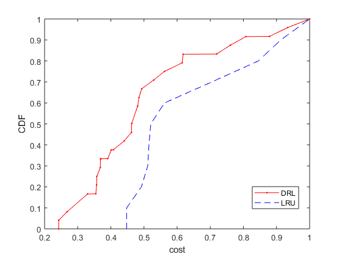

# A2C Proactive Caching with Heuristic Passive Caching

This work is inspired by [Pensieve](http://web.mit.edu/pensieve/).

### Formulation
* User --- Edge Cache --- Cloud
* Fixed bandwidth on fronthaul; Varied bandwidth on backhaul;
* Collect cost with delay (and storage penalty) in proactive caching session;
* Cope with heuristic algorithm in passive caching session

### Performance
